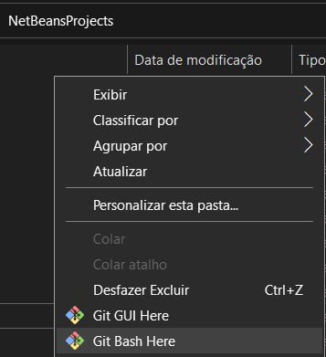

# Tutorial

## Noções Básicas

---

Luan, você terá que ter no mínimo a ferramenta Git instalada

Após isso, tenha em mente os comandos básicos para clonar o projeto, adicionar quaisquer mudanças, commitar e pushar

Antes de qualquer coisa, certifique-se de que acessou a pasta correta

O caminho é este: Documentos/NetBeansProjects

Abra o Git **ainda** na pasta dos projetos do NetBeans



Assim que abrir o Git, copie estes arquivos, se não tiver eles ainda, usando o ```git clone```

```git
    git clone https://github.com/YuuY314/MenuAnimais
```

Creio que toda esta etapa inicial não será mais repetida (a não ser que esteja usando computadores públicos)

## Comandos Utilizados

---

OBS: Toda a configuração inicial foi feita, não se preocupe com isso

OBS2: Quando seus arquivos estiverem desatualizados comparados aos do repositório, use o seguinte comando:

```git
    git pull https://github.com/YuuY314/MenuAnimais
```

## Passo a Passo

```git
    git add . ou git add *           (adicionar todos os arquivos, até as mudanças efetuadas nos arquivos)
    git status                       (opcional, mas sempre bom conferir o que está rolando)
    git commit -m "[nome do commit]" (registrar o commit)
    git push origin main             (atualizar o repositório no Github)
```
